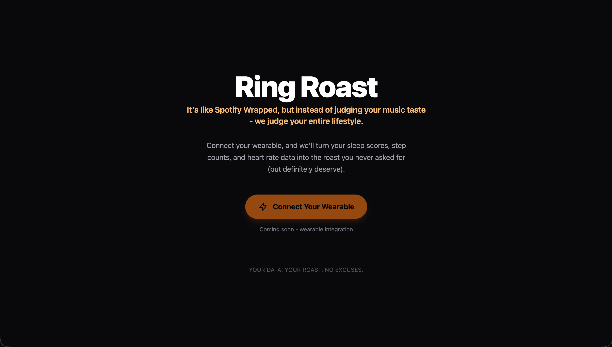

# Ring Roast

A Rails 8 web application that demonstrates how to integrate with the [Open Wearables](https://openwearables.io) platform - a unified API for connecting and syncing health data from multiple wearable devices.



- [Open Wearables Documentation](https://openwearables.io/docs)
- [Open Wearables GitHub](https://github.com/the-momentum/open-wearables)

## What it does

This app is a reference implementation showing three core integration patterns:

1. **User auth flow with wearable providers** - Generate connection links via the Open Wearables API, redirect users to authenticate with their wearable provider (Garmin, Whoop, Oura, Polar, Suunto, Strava, etc.), and handle the OAuth callback.
2. **Pulling data from the Open Wearables API** - Fetch normalized health data (heart rate, sleep, activity, steps, HRV, recovery, strain) through the unified REST API.
3. **Receiving webhooks from Open Wearables** - Accept incoming webhook notifications when new health data or health insight automations are triggered.

## Open Wearables concepts

- **Unified API**: Single REST API (authenticated via `X-Open-Wearables-API-Key` header) that normalizes data across all wearable providers.
- **Providers**: Wearable platforms the user connects - cloud-based (Garmin, Whoop, Polar, Suunto, Strava, Oura) and SDK-based (Apple HealthKit, Samsung Health, Google Health Connect).
- **Connect flow**: Generate a connection link for a user -> user authenticates with their provider via OAuth -> data syncs automatically -> access via API.
- **Health data types**: Activity/workouts, sleep (stages, efficiency, duration), biometrics (heart rate, HRV), recovery scores, strain metrics, steps.

For more details, see the [Open Wearables docs](https://openwearables.io/docs) and [API reference](https://openwearables.io/docs/api-reference/introduction).

## Stack

- Ruby 3.3.1 / Rails 8.0.5
- SQLite3 (primary, cache, queue, cable)
- Hotwire (Turbo + Stimulus) with ImportMap
- Tailwind CSS
- Propshaft asset pipeline
- Solid Queue, Solid Cache, Solid Cable
- Puma with Thruster

## Getting started

```bash
./bin/setup    # Install deps, create DBs
./bin/dev      # Start dev server with Tailwind watcher (port 3000)
```

### Credentials

This app uses **Rails credentials** (not ENV variables) for secrets like API keys. Edit them with:

```bash
bin/rails credentials:edit
```

This requires `config/master.key` to be present locally (not committed to git).

## Deploying to Railway

The app ships with a production-ready Dockerfile, so Railway can build and deploy it directly.

### 1. Create a Railway project

1. Go to [railway.app](https://railway.app) and log in.
2. Click **New Project** -> **Deploy from GitHub Repo** and select this repository.

### 2. Add a persistent volume

SQLite databases live in `storage/`, so you need a volume to persist them across deploys:

1. In your Railway service, go to **Settings** -> **Volumes**.
2. Add a volume mounted at **`/rails/storage`**.

### 3. Set environment variables

In the **Variables** tab, add:

| Variable | Value |
|---|---|
| `RAILS_MASTER_KEY` | Contents of `config/master.key` |
| `RAILS_ENV` | `production` |

You can get your master key locally with:

```bash
cat config/master.key
```

### 4. Configure the port

Railway assigns a dynamic port via the `PORT` env var. Either set `PORT=80` in Railway variables, or override the start command to:

```
./bin/thrust ./bin/rails server -p $PORT
```

### 5. Generate a public URL

In **Settings** -> **Networking**, click **Generate Domain** to get a `*.up.railway.app` URL.

Railway will automatically build from the Dockerfile on every push to your main branch.
